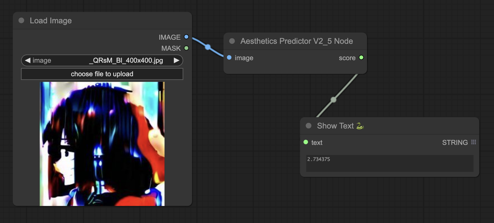

# ComfyUI Aesthetic Predictor V2.5 Node

Simple ComfyUI node that predicts the score of an aesthetic image with SigLIP-based predictor.

<p align="center">
  
</p>

## Installation

```bash
git clone --recursive https://github.com/discus0434/aesthetic-predictor-v2-5.git
cd aesthetic-predictor-v2-5
pip install -r requirements.txt
```

## Usage

- Input: Image Tensor
- Output: Aesthetic Score
